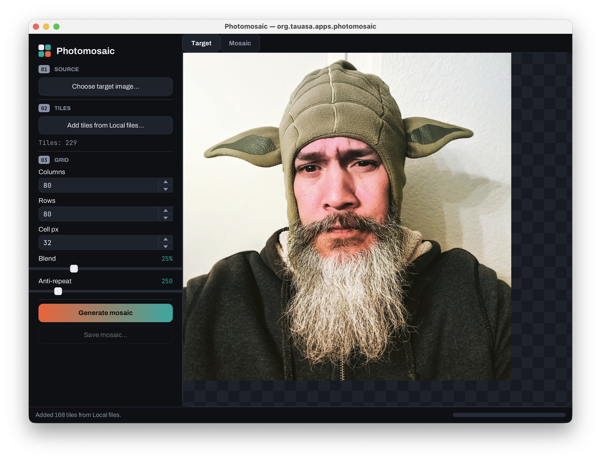
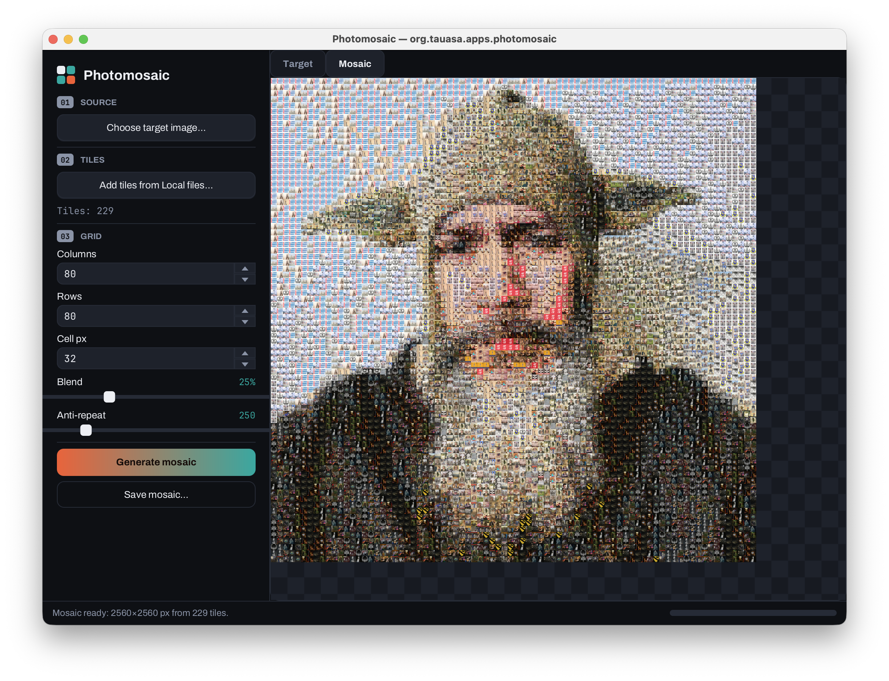

# Photomosaic Desktop App

A JavaFX desktop app that builds **photomosaics** — recreating a target image out of a grid of smaller photos. Tile images are supplied through a pluggable **`PhotoProvider`**; the default implementation picks them from your **local filesystem**. Tiles are scaled with **Thumbnailator**; **TwelveMonkeys ImageIO** widens the range of source formats the app can decode.




---

## What it does

1. Pick a **target image** (the picture you want to recreate).
2. Gather **tile images** from a `PhotoProvider` (a local folder, by default).
3. Tune the grid (columns × rows, cell size, colour blend, anti-repeat).
4. **Generate** and **save** the mosaic as PNG/JPEG.

---

## Quick start

```bash
mvn clean javafx:run        # run from source
# or
mvn clean package           # build a fat jar
java -jar target/photomosaic.jar
```

Requires JDK 17+. JavaFX is pulled in by Maven, so no separate SDK install is needed. There
are no accounts, keys, or network setup — click *“Add tiles from Local files”*, point it at a
folder of images, and go.

---

## The PhotoProvider abstraction

Tile sources are pluggable. The contract splits choosing from loading so the UI stays
responsive:

```java
public interface PhotoProvider {
    String displayName();                          // UI label
    List<PhotoRef> select(Window owner) throws Exception;  // on the FX thread; quick
}

public interface PhotoRef {
    String id();                                   // e.g. a filename
    BufferedImage load() throws IOException;       // off the FX thread; does the I/O
}
```

`select(...)` runs the (usually interactive) picking step and returns cheap handles; the app
then calls `PhotoRef.load()` for each handle on a background thread, with a progress bar.

**`LocalPhotoProvider`** is the default: it shows a folder chooser and turns every image file
inside into a `PhotoRef` (decoded lazily via `ImageIO`). Construct it with
`new LocalPhotoProvider(true)` to recurse into sub-folders.

### Adding another source

Implement `PhotoProvider`, then register it in `PhotomosaicApp`:

```java
private final List<PhotoProvider> providers =
        List.of(new LocalPhotoProvider(), new MyOtherProvider());
```

The UI builds one *“Add tiles from …”* button per registered provider automatically — nothing
else changes. (A cloud-photo or URL-list provider would slot in exactly here.)

---

## Project layout

```
org.tauasa.apps.photomosaic
├── Launcher                  plain main() → starts JavaFX cleanly from a fat jar
├── PhotomosaicApp            the JavaFX UI; registers PhotoProviders
├── Theme                     loads bundled fonts + applies the stylesheet
├── mosaic
│   ├── ColorAnalysis         average colour (pixel sum) + Thumbnailator resize
│   ├── Tile                  a source image + its colour signature + cached render
│   ├── TileLibrary           nearest-colour matching (redmean) + anti-repeat
│   ├── MosaicConfig          grid / cell / blend settings
│   └── MosaicEngine          the algorithm
└── provider
    ├── PhotoProvider         pluggable tile source (interface)
    ├── PhotoRef              a lazily-loadable photo handle (interface)
    └── LocalPhotoProvider    default: pick a folder from the local filesystem

resources/org/tauasa/apps/photomosaic
├── theme.css                 "tesserae" dark theme (matches the PWA)
├── checker.png               transparency checker behind the preview
└── fonts/                    Archivo + JetBrains Mono (SIL OFL, bundled)
```

---

## Look & feel

The desktop UI shares the PWA's **"tesserae"** identity: a darkroom-ink workspace, two
accent colours (ceramic vermilion + glass teal) used sparingly, numbered section chips, a
gradient *Generate* button, mono numeric readouts, and a transparency-checker preview.

It's all driven by `theme.css` (JavaFX CSS) plus two bundled open-source typefaces —
**Archivo** for display/body and **JetBrains Mono** for data — both under the SIL Open Font
License (see `resources/.../fonts/OFL-*.txt`). `Theme.loadFonts()` registers them at startup,
and the CSS falls back to system fonts if a face is ever unavailable.

---

## How the algorithm works

The target is shrunk to `columns × rows` with high-quality progressive scaling, so eachcresulting pixel approximates the average colour of one cell. For every cell we pick the nearest tile by a **redmean-weighted** colour distance (cheap perceptual approximation), with an optional penalty that discourages reusing the same tile. The chosen tile — pre-scaled once to the cell size — is blitted in, and an optional translucent wash of the cell's true colour nudges the result toward the original.

### Ideas for later
- **Lab / CIEDE2000** matching for more faithful colour.
- **k-d tree** over tile signatures (linear scan is fine for hundreds of tiles, less so for 10k+).
- Multiple **sub-cell samples** per tile for edge-aware placement.
- More `PhotoProvider`s (cloud albums, a URL list, a stock-photo API).
